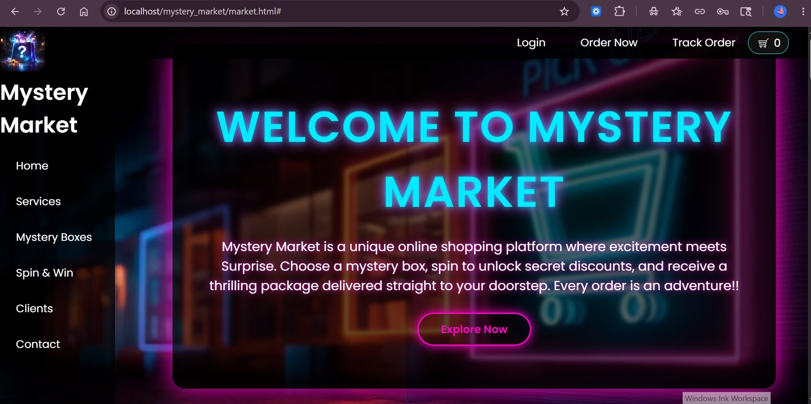
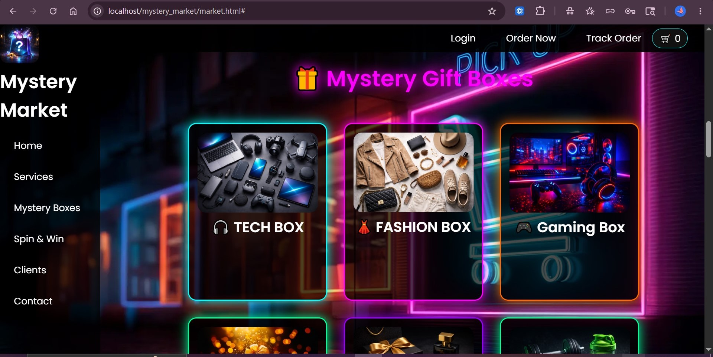
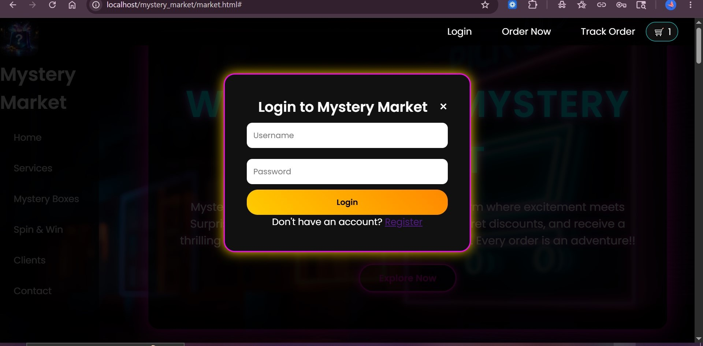

# 🎁 Mystery Market

A fun and interactive mystery box shopping website where users can explore surprise gift boxes, spin a wheel to win discounts, and place orders online.

---

## 🌟 Features

- 🎁 9 Mystery Gift Boxes with flip card animations
- 🎡 Spin & Win wheel for discount rewards
- 🛒 Cart system with checkout
- 👤 User login & registration
- 💾 PHP & MySQL backend
- 🔔 Toast notifications
- 📦 Order placement with payment selection

---

## 🛠️ Built With

- HTML5
- CSS3
- JavaScript
- PHP
- MySQL

---

## 📸 Screenshots





---

## ⚙️ How to Run

1. Install XAMPP
2. Clone this repository into your `htdocs` folder
3. Open phpMyAdmin and create a database called `mystery_market`
4. Create a `users` table:
```sql
   CREATE TABLE users (
       id INT AUTO_INCREMENT PRIMARY KEY,
       username VARCHAR(50) NOT NULL,
       email VARCHAR(100) NOT NULL,
       password VARCHAR(255) NOT NULL
   );
```
5. Open browser and go to `http://localhost/mystery_market`

---

## 👩‍💻 Developer

Made with ❤️ by Muskan
